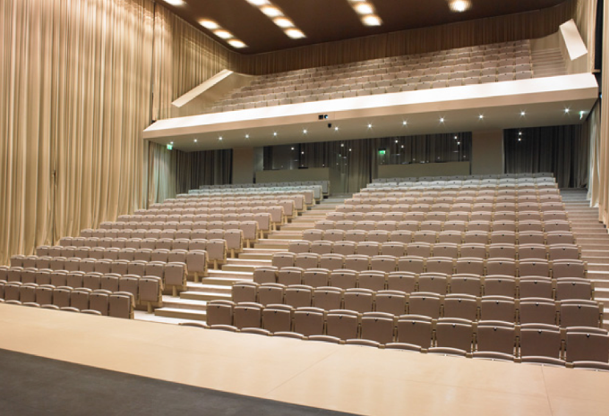
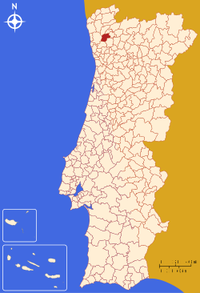
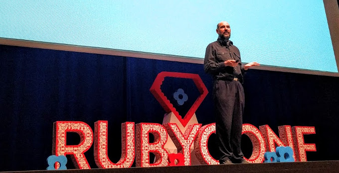
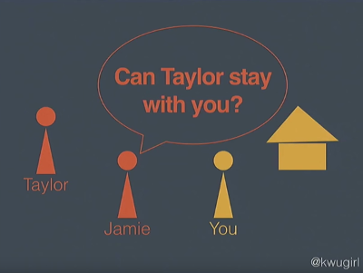
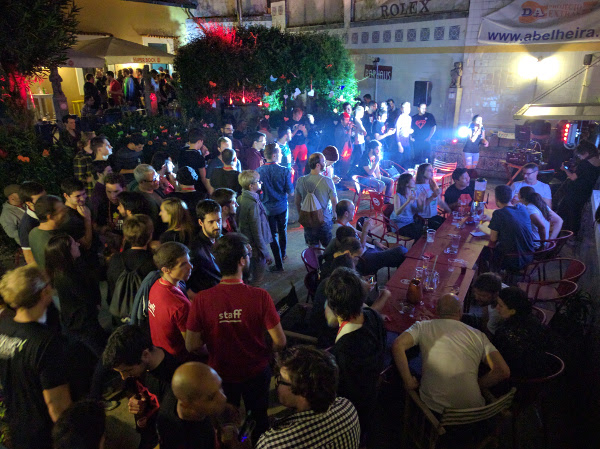
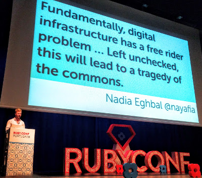
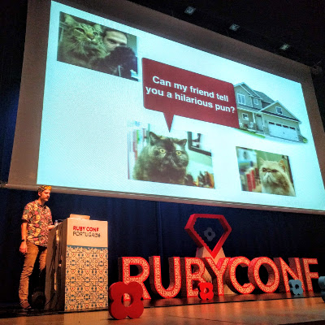

class: center, middle

# Ruby Conf Portugal '16
## Recap
## Kuba Kuźma

SRUG

Tuesday, January 10, 2017

---

# RubyConf.pt

* October 27-28 (Thursday - Friday)
* medium sized conference (capacity for 300 people)
* regular ticket price €200 (2 lunches included)
* started in 2014 (the third edition)
* CoC included

---

class: center, middle

# Venue

Auditório Vita

---

# Braga

* town founded in 20 BCE
* 180k inhabitants
* the best francesinhas

.center[]

---

# Francesinha

.center[]

---

# Martin Fowler
## Software Design in the 21st Century

.center[]

---

class: center

# Refactoring

My code doesn't work at the moment…

…I'm in a middle of a refactoring process.

---

# Dark Patterns

* [darkpatterns.org](http://darkpatterns.org/)

.center[]

---

# Moral Responsibility

* programmers **are** responsible for i.e. VW, Yahoo! scandals
* everyone has its own excuses

.center[You have a moral responsibility for the code you write!]

---

# Challenges for our Community

* alienating atmosphere

for groups historically discriminated against

* privacy

…but I have nothing to hide

---

# Katherine Wu
## Ask vs. Guess Culture

.center[]

---

# Ask vs. Guess Culture

* ask culture

*I'll just tell them no.*

* guess culture

*Ugh, this puts me in a difficult position.*

&nbsp;

.center[It's not a binary thing, there's a whole spectrum.]

---

# Piotr Szkotkowski
## They Hear Me Typin', They Hatin'

.center[]

---

# Compose Key

* [compose]+["]+[u] = ü
* [compose]+[/]+[L] = Ł

---

# Panel
## Sexist AC

* different body composition between men and women (study from 1998)

Increasing temperature in your office

* decreases error count in both sexes (study from 2004)
* reduces energy consumption

---

# Panel
## RFC Process that Rust has and Ruby lacks

* [github.com/rust-lang/rfcs](https://github.com/rust-lang/rfcs)
* changes in Ruby are discussed on Redmine
* the best way of introducing a substantial change is going to Japan

---

# Karaoke Party

.center[]

---

# Yehuda Katz
## Zen and Art of Package Management

---

class: center, middle

This page intentionally left blank…

---

# Pat Allan
## Open Source: Power and the Passion

.center[]

---

## Open Source: Power and the Passion

* the tragedy of the commons

*rubygems.org hosting costs $32,000 per month*

* we'd like to reduce barriers to entry

* [rubytogether.org](https://rubytogether.org/)

---

# Aaron Patterson
### Methods of Memory Management in MRI

.center[]

---

# Methods of Memory Management in MRI

* generational garbage collector
* write barrier

---

# Summary

* 2 days
* 12 talks
* 2 lightning talk sessions
* 2 lunches
* discussion panel
* karaoke party
* Portugal ❤❤❤
